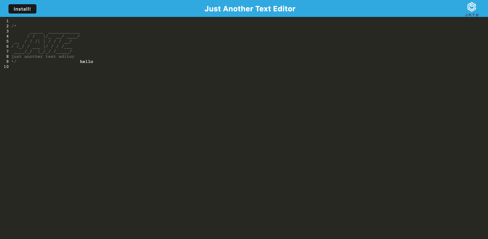

# pwa-texteditor

## Overview

In this project, i modified the starter code to create a web text editor where the user can create notes or code snippets with or without an internet connection and where the user can reliably retrieve them for later use.

## Technologies:

- Node.js
- Express.js
- Heroku
- pwa

## ScreenShot

## Link

- Github URL: https://github.com/ramlaahmed/pwa-texteditor

- Heroku: https://murmuring-shelf-20147.herokuapp.com/
